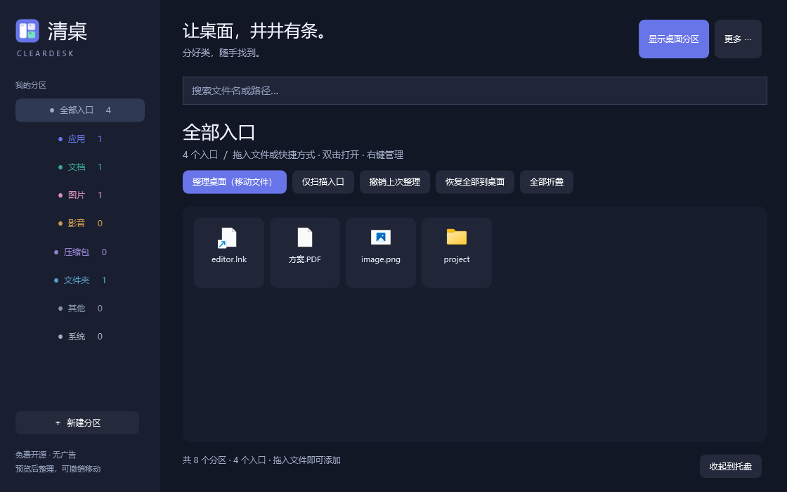

# 清桌 ClearDesk


免费、无广告、无遥测的 Windows 开源桌面整理器。把文件、文件夹和软件快捷方式归入半透明灰色分区，数据保存在本机，无需账号。

**[免费下载 Windows 版](https://github.com/YDZ-syj/ClearDesk/releases/tag/v0.5.0)** · [发布记录](https://github.com/YDZ-syj/ClearDesk/releases) · [MIT 许可](LICENSE)

当前版本 **0.5.0（公开测试版）**。需要 Windows 10 / 11 和 .NET Framework 4.8，无需管理员权限。



## 使用

1. 下载 `ClearDesk-0.5.0-windows.zip` 并解压，运行 `ClearDesk.exe`。保留同目录的 `ClearDesk.exe.config` 和 `ClearDesk.IconGuard.exe`。
2. 启动后自动扫描个人及公共桌面，按类型建立分区。默认只建立文件入口，不搬动文件；也可拖入文件或新建自己的分区。
3. 分区默认折叠。点击箭头展开，拖动标题栏移动，拖动边缘或角落调整大小。右键标题栏可重命名，编辑分区可调整背景浓度。
4. 点击标题栏「锁定」固定位置和大小，再点「已锁」解锁。锁定后仍可展开、折叠、打开文件和调整文件顺序，状态会保存。
5. 双击入口打开文件；拖到另一个入口前改变顺序，拖到空白处放到末尾。支持跨分区拖动、拖出到桌面及向其他应用拖放文件。
6. 需要真正清理原桌面时，点击「整理桌面（移动文件）」，检查原路径、目标路径和跳过清单，再确认移动。默认收纳目录为个人桌面旁的 `ClearDesk Library`。
7. 关闭管理窗口会收起到托盘；从托盘退出才结束程序。正常退出默认把已整理文件恢复到原位置；也可在「更多」中关闭此选项。

管理窗口支持搜索、配置导入导出、全部展开/折叠及自动分类设置。分区显示时临时隐藏原桌面图标，隐藏分区或退出后恢复；分区不出现在 Alt+Tab 中。

## 文件与恢复

- 删除分区或移除入口不会删除原文件。
- 实际整理只移动适用的个人桌面文件；公共桌面、系统图标、程序本体、安装包、脚本和重解析链接等会跳过。同名冲突不覆盖，移动前核对 Windows 文件标识。
- 「撤销上次整理」恢复一批，「恢复全部到桌面」恢复全部可恢复批次。恢复冲突时保留文件并提示，解决后可重试。
- 异常退出时，独立保护助手恢复原桌面图标显示；已移动的文件仍在收纳目录，可重新启动后恢复。保护助手不执行文件搬动。
- 拖出到桌面时恢复已整理文件；仅引用的外部文件会复制到个人桌面并保留外部原件。向其他应用拖放的移动由 Windows 和目标应用处理，不属于整理撤销范围。
- 配置与移动历史位于 `%LOCALAPPDATA%\ClearDesk`。请连同收纳目录一起备份；配置导出不包含文件内容或移动历史。卸载前先恢复文件，不要把收纳目录当作缓存删除。

## 动态壁纸

使用真正的透明窗口，不采样静态壁纸，不修改 Wallpaper Engine 设置或桌面宿主。若点击分区导致 Wallpaper Engine 暂停，可在其「设置 → 性能 → 应用规则」中为 `ClearDesk.exe` 设置 Keep Running，见[官方说明](https://help.wallpaperengine.io/en/functionality/applicationrules.html)。

混合 DPI 和 Explorer 重启已通过作者本机手动验证。更多机器、虚拟桌面及不同动态壁纸类型仍需反馈，详见[测试记录](docs/TESTING.md)。

## 从源码构建

使用 C# / WPF / .NET Framework，当前不依赖 NuGet 或 .NET SDK。在 Windows PowerShell 中运行：

```powershell
powershell -NoProfile -ExecutionPolicy Bypass -File .\build.ps1
powershell -NoProfile -ExecutionPolicy Bypass -File .\build.ps1 -Test
powershell -NoProfile -ExecutionPolicy Bypass -File .\tools\package.ps1 -ReleaseDirectory dist
```

输出位于 `dist/`，包含程序、Windows ZIP、源码 ZIP 和 SHA-256 校验文件。也可用 Visual Studio 与 .NET Framework 4.8 开发工具打开 `ClearDesk.csproj`。

## 参与项目

欢迎通过 Issues 提交复现步骤或建议，通过 Pull Request 贡献改进。详见[贡献指南](CONTRIBUTING.md)、[实现与参考资料](docs/RESEARCH.md)和[更新记录](CHANGELOG.md)。源码和原创图标采用 MIT 许可，允许免费使用、修改与分发。

提交问题时请隐去用户名、私人路径和文件内容，不要上传个人配置或完整桌面截图。
